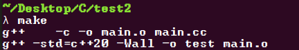

# MakeFile-maker

## 개발자
- Shin4(신현규)

## 설명
컴파일을 직접치기 귀찮어서, Makefile이 만들어졌는데, Makefile도 만들기 귀찮아, 자동으로 생성해주는 프로그램입니다.

## 사용법
\
\

### 1.터미널을 킨다
\
\

### 2.MakeFile.php와 자신이 작업한 소스코드들과 함께 디렉토리에 놓는다
\
\

### 3.php MakeFile.php [c or cpp] [version] [file_name] 형식으로 입력한다(기본 value는 cpp, 17, start로 정해져있음)
\
\

### 4.Makefile이 생성되어있음을 확인할 수 있다.
\
\

### 5.컴파일을 하면 된다

## 개발 소요 시간
약 50분
